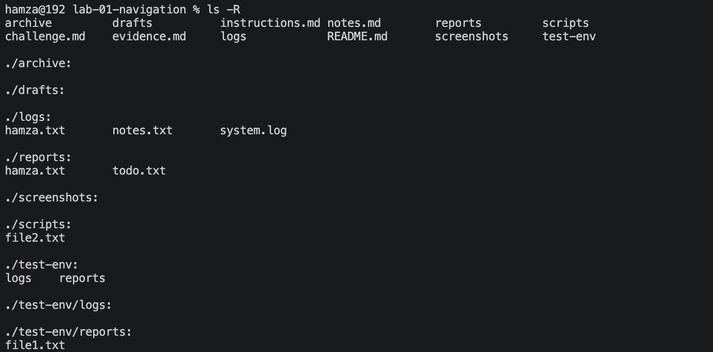
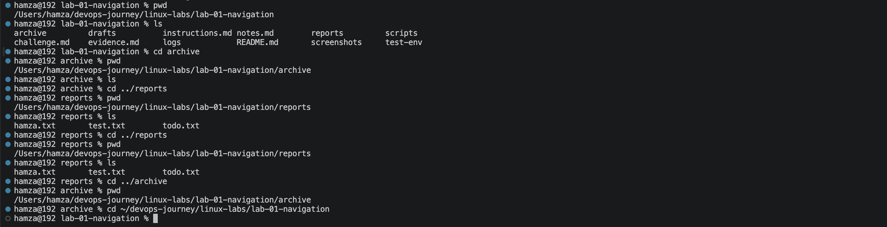
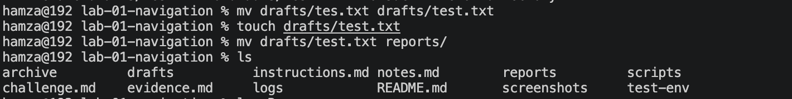

# Lab 01 — Linux Navigation & File Management

**Environment:** macOS Sequoia | Zsh | VS Code Terminal | Apple Silicon (M-series)

---

## Problem

Operating in a Linux environment without clear navigation leads to slow workflows,
file misplacement, and errors.
Needed a reliable way to move through the filesystem, manage files,
and recover from mistakes without guessing.

---

## What I Built

A structured Linux workspace with directories (`logs`, `reports`, `drafts`,
`scripts`, `archive`) and a repeatable workflow to navigate, organise,
and manage files efficiently.

---

## How I Solved It

**Navigation:**
- Used `pwd` before every move — in a deep directory tree one wrong assumption
  costs minutes of backtracking
- Used `ls` to inspect before acting — never assumed a file or folder existed
- Relative paths (`cd ../reports`) for quick sibling movement
- Absolute paths (`cd ~/devops-journey/linux-labs/...`) when location was uncertain

**File Management:**
- `mv` to move and rename — one command, two uses
- `cp` to duplicate safely before destructive operations
- `rm` used deliberately, always verified with `ls` after
- `mkdir` / `rmdir` for directory control

**Verification habit:**
Every single operation was confirmed with `ls` or `pwd` before moving on.
This is not optional — it is the habit that prevents compounding errors.

---

## Proof

### Directory structure

### Navigation — relative and absolute paths

### File operation — move and verify

### Break/fix — wrong path error and recovery

---

## Break/Fix Summary

| Issue | Cause | Fix |
|---|---|---|
| `cd reports` failed from archive/ | reports is a sibling, not a child | `cd ../reports` |
| Absolute path not found | Missing `linux-labs/` in path | Added full correct path |
| `mv` failed with `>` operator | Used shell redirect instead of argument | `mv source destination/` |
| Renamed wrong file | Assumed filename without checking | `ls` first, then `mv` |
| `echo` created wrong files | Incorrect syntax order | `echo "text" >> file.txt` |

---

## Key Takeaway

Linux does not guess — every command depends on correct paths.
The engineers who work fastest are not the ones who memorise the most commands.
They are the ones who verify before acting and diagnose before fixing.

---

## Next Step

[Lab 02 — Editing Files & Permissions](../lab-02-editing-permissions/)