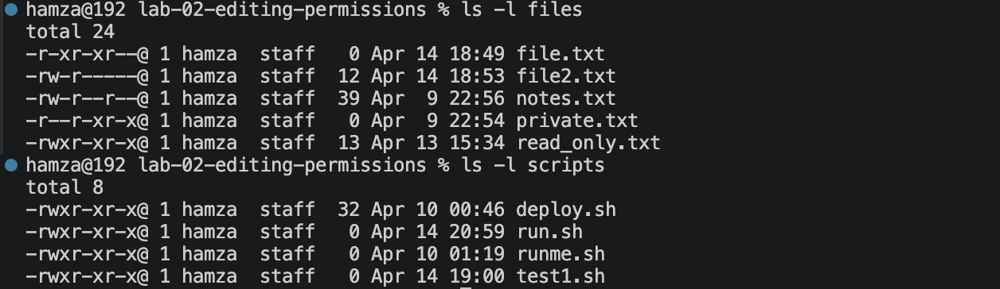
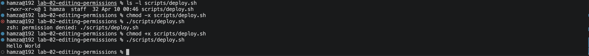
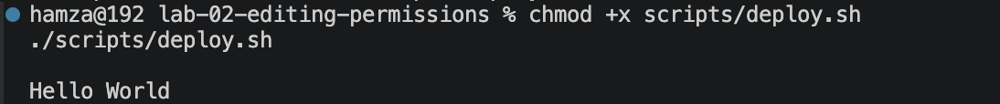
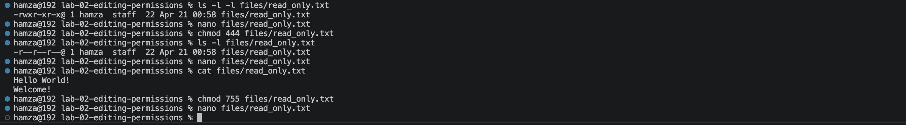

# Lab 02 — Linux Permissions & File Control

**Environment:** macOS Sequoia | Zsh | VS Code Terminal | Apple Silicon (M-series)
> Note: permission behaviour follows Linux conventions — tested against standard Unix permission model

---

## Problem

In a Linux system, incorrect permissions can completely block execution,
data access, or modification.
Scripts fail, files become unreadable, and systems break if permissions
are not understood and controlled precisely.

Needed a reliable way to:
- inspect permissions before acting
- control access (read / write / execute) intentionally
- diagnose permission failures from first principles
- recover safely without guessing

---

## What I Built

A controlled Linux environment with:
- files — `notes.txt`, `private.txt`, `read_only.txt`
- scripts — `deploy.sh`, `runme.sh`
- configs — `app.conf`

Used this environment to simulate and recover from:
- execution failures
- read/write restrictions
- permission misconfigurations

---

## How I Solved It

**Permission Inspection:**
- Used `ls -l` as the first step in every diagnosis — never guessed
- Read permission strings in three levels: owner → group → others
- Identified file type from the leading character (`-` = file, `d` = directory)

**Permission Control — Symbolic Mode:**
- `chmod +x` → grant execute — required before any script can run
- `chmod -w` → remove write — used to simulate and diagnose edit failures
- Symbolic mode is faster for single targeted changes

**Permission Control — Numeric Mode:**
- `755` → owner has full control (rwx), everyone else can read and run but
  never modify — the standard safe permission for scripts
- `644` → owner can read and write, everyone else read-only —
  the standard safe permission for config files and documents
- `455` → owner cannot write — used to simulate a locked file scenario
- `444` → nobody can write — read-only for everyone, used for protected files
- Numeric mode is faster when setting all three permission groups at once

**Execution Logic:**
A script requires two things to run:
1. correct shebang (`#!/bin/bash`) — tells the shell which interpreter to use
2. execute permission (`x`) — without this the OS refuses to run it
If either is missing the script fails — both must be present

**Verification Habit:**
Every permission change was confirmed with:
- `ls -l` to inspect the new permission string
- actual execution attempt (`./script.sh`) to confirm it worked
- file access attempt (`cat`, `nano`) to confirm read/write behaviour

---

## Proof

### Permission inspection

### Script execution — before and after chmod

### Break/fix — execute removed and restored

### Break/fix — read/write restriction and recovery

---

## Break/Fix Summary

| Issue | Cause | Fix |
|---|---|---|
| Script would not run | Execute permission missing | `chmod +x script.sh` |
| Permission denied on execution | Removed `x` accidentally | `chmod +x script.sh` |
| File could not be edited | Write permission removed | `chmod 755 file.txt` |
| File could not be read | Read permission removed | `chmod 755 file.txt` |
| Script failed — bad interpreter | Shebang was `#!bin/bash` | Fixed to `#!/bin/bash` |
| Wrong chmod command used | Typed `ls 455` instead of `chmod` | `chmod 455 file.txt` |

---

## Key Takeaway

Permissions are not theoretical — they directly control what a system allows.

Most failures follow a predictable pattern:
- no `r` → cannot read the file
- no `w` → cannot modify the file
- no `x` → cannot execute the script

The critical skill is not memorising chmod values.
It is seeing `permission denied`, knowing immediately which permission is missing,
and fixing it in one command.

---

## Next Step

[Lab 03 — Text Processing & System Inspection](../lab-03-working-with-text/)