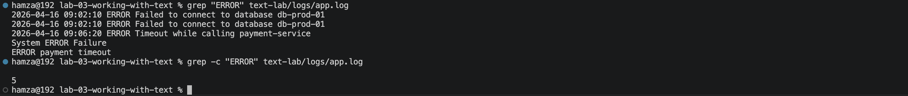
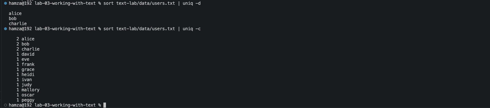
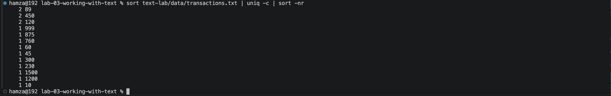
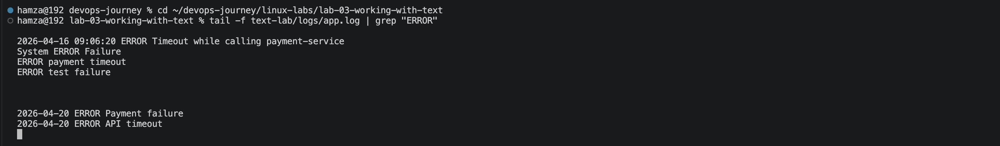
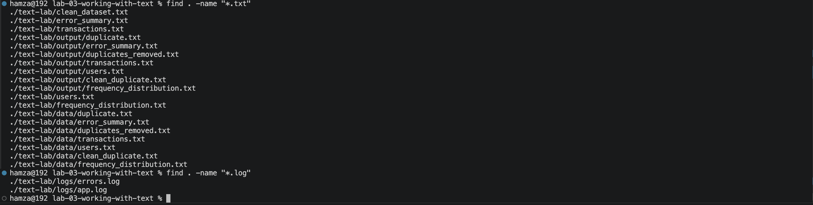

# Lab 03 — Linux Text Processing & System Inspection

**Environment:** macOS Sequoia | Zsh | VS Code Terminal | Apple Silicon (M-series)

---

## Problem

A Linux server is generating logs, user records, and transaction data.
Users are reporting failures, duplicate records exist, and suspicious
activity may be present.

Needed to diagnose and extract answers from live system data
without opening files manually — using only command-line workflows.

---

## What I Built

A working lab environment simulating a live server:
- `text-lab/logs/app.log` — application logs with INFO, WARNING, ERROR entries
- `text-lab/logs/errors.log` — isolated error stream
- `text-lab/data/users.txt` — user records with intentional duplicates
- `text-lab/data/transactions.txt` — numeric transaction values with repeated amounts

All data was realistic — repeated errors, duplicate users, suspicious
transaction patterns — to simulate genuine system investigation.

---

## How I Solved It

**Log Investigation:**
- `grep "ERROR" logs/app.log` → extract all failure events instantly
- `grep -c "ERROR" logs/app.log` → count total occurrences without manual scanning
- `grep "ERROR" logs/app.log | sort | uniq -c | sort -nr` → rank errors by
  frequency — the most common failure surfaces immediately
- `tail -f logs/app.log | grep "ERROR"` → monitor live logs and filter
  for failures in real time — this is how production systems are watched

**Data Quality Analysis:**
- `sort data/users.txt | uniq -d` → expose duplicate records
- `sort data/users.txt | uniq` → produce a clean deduplicated dataset
- `sort data/users.txt | uniq -c` → count how many times each user appears —
  frequency over 1 signals corruption
- Reduced dataset from 16 rows to 13 clean unique users

**Numeric Analysis:**
- `sort -n data/transactions.txt` → rank values lowest to highest
- `sort -nr data/transactions.txt` → rank highest to lowest —
  surfaces outliers immediately
- `sort data/transactions.txt | uniq -c | sort -nr` → frequency distribution —
  repeated transaction amounts can signal automated fraud or system bugs

**File Discovery:**
- `find . -name "*.txt"` → locate all text files without knowing their location
- `find . -name "*.log"` → locate all log files across the entire directory tree
- Wildcards (`data/*.txt`, `logs/*.log`) → operate across multiple files
  in one command — essential in large systems with hundreds of files

---

## Proof

### Error extraction and count


### Duplicate user detection


### Frequency distribution pipeline


### Live log monitoring


### File discovery with find


---

## Break/Fix Summary

| Issue | Cause | Fix |
|---|---|---|
| `grep "error"` returned nothing | File used uppercase `ERROR` | `grep -i "error"` for case-insensitive search |
| `wc -l < app.log` failed | Wrong path — not in logs/ directory | `wc -l < logs/app.log` |
| `tail -f logs.app` failed | Dot instead of slash in filename | `tail -f logs/app.log` |
| `ls *.txt` returned nothing | No .txt files in current directory | `ls data/*.txt` — wildcards need correct location |
| `find . -name "data/users.txt"` returned nothing | find -name takes filename not path | `find . -name "users.txt"` |
| `cat logs/app.log \| grep "ERROR"` worked but inefficient | Unnecessary cat process | `grep "ERROR" logs/app.log` directly |
| Duplicates with different case not caught | `uniq` is case-sensitive | `sort file \| uniq -i` |

---

## Key Pipelines

```bash
# Count total errors
grep "ERROR" logs/app.log | wc -l

# Rank errors by frequency — most common failure first
grep "ERROR" logs/app.log | sort | uniq -c | sort -nr

# Detect duplicate users
sort data/users.txt | uniq -d

# Transaction frequency distribution
sort data/transactions.txt | uniq -c | sort -nr

# Monitor live logs for errors only
tail -f logs/app.log | grep "ERROR"

# Find all log files from any location
find . -name "*.log"
```

---

## Key Takeaway

The difference between a beginner and an engineer is not knowing more commands —
it is knowing how to chain them.

A single pipe turns a raw log file into an instant answer.
`grep | sort | uniq -c | sort -nr` is not four commands —
it is one question: *what is failing most often?*

Never open a file manually when a command can answer the question faster.

---

## Next Step

[Lab 04 — Shell I/O & Redirection](../lab-04-shell-io-redirection/)
