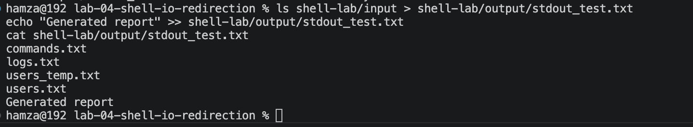
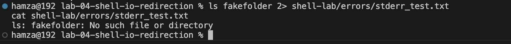
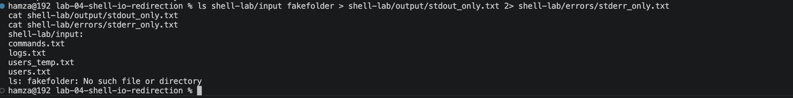
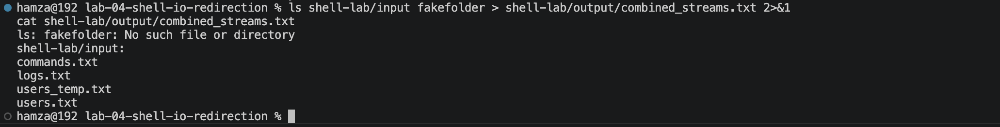
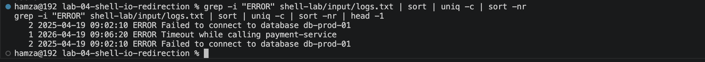
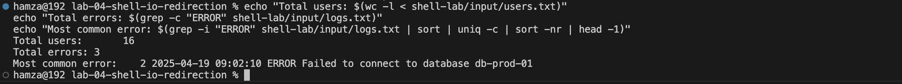
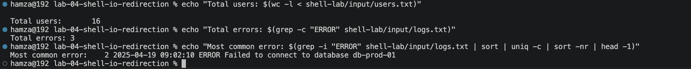

# Lab 04 — Shell I/O, Redirection & Command Control

**Environment:** macOS Sequoia | Zsh | VS Code Terminal | Apple Silicon (M-series)

---

## Problem

In real systems, commands produce normal output and errors simultaneously.

Without precise control over `stdin`, `stdout`, and `stderr`, debugging becomes guesswork and automation becomes unreliable.

Needed to understand and control exactly:

- where output goes
- where errors go
- how commands connect and share data
- how to build workflows that never lose output accidentally

---

## What I Built

A structured shell environment simulating a live system:

- `input/` — source data: users, logs, commands
- `output/` — captured command results and generated reports
- `errors/` — isolated error streams
- `temp/` — intermediate working files

Used this environment to simulate real redirection scenarios, build pipelines, and generate a live incident report from raw log data.

---

## How I Solved It

**Output Redirection:**

- `>` overwrites a file completely — one wrong use destroys existing content
- `>>` appends without touching existing content — safer when preserving logs or reports
- Critical distinction: `>` is destructive by default, `>>` preserves existing data

**Input Redirection:**

- `wc -l input/users.txt` → counts lines but includes the filename in output
- `wc -l < input/users.txt` → counts lines with no filename
- `<` makes the shell feed the file into the command as input

**Error Redirection:**

- `2>` captures `stderr` into a file
- `2>>` appends errors without overwriting previous error logs
- Separating errors from normal output is essential in production because useful output and failures should not be mixed accidentally

**Separating stdout and stderr:**

- `ls input fakefolder > output/stdout_only.txt 2> errors/stderr_only.txt`
- Normal output goes into `output/stdout_only.txt`
- Error output goes into `errors/stderr_only.txt`
- This makes debugging cleaner because successful output and failures are inspected separately

**Combining Streams:**

- `2>&1` merges `stderr` into `stdout`
- Used for unified logging when one file needs the full command result
- Example: `ls input fakefolder > output/combined_streams.txt 2>&1`
- Order matters: `> file 2>&1` works as intended

**Pipes:**

- `|` passes `stdout` of one command into `stdin` of the next
- No intermediate files are needed
- Data flows through the pipeline step by step
- Pipes turn raw command output into useful answers

**Command Substitution:**

- `$(...)` runs a command and injects its result into another command
- This makes shell workflows dynamic
- Example: `echo "Total errors: $(grep -c "ERROR" input/logs.txt)"`

**Environment & Discovery:**

- `$PATH` controls which directories the shell searches to find commands
- If a command is not in `$PATH`, the shell cannot find it
- `env` shows environment variables
- Exported variables are visible to child processes
- Unexported shell variables only exist in the current shell
- `which`, `type`, `man`, and `--help` help inspect commands quickly

**sudo Awareness:**

- `sudo` runs a command with elevated privileges
- It is useful for installing software, modifying protected files, or changing system-level settings
- It should not be used blindly because it can damage the system if misused

---

## Proof

### stdout — overwrite vs append



### stderr — isolated error capture



### Separating stdout and stderr into different files



### Combining stdout and stderr with `2>&1`



### Pipeline — error frequency analysis



### Command substitution — dynamic incident report



### Environment variables — export and subshell verification



---

## Break/Fix Summary

| Issue | Cause | Fix |
|---|---|---|
| Typo in redirect filename: `txxt` | Filename error | Correct path: `output/redirect_output.txt` |
| Output file created in wrong directory | No path specified | Always use full path in redirect target |
| `2>>&1` syntax error | Invalid operator combination | Correct syntax: `2>&1` |
| `>` destroyed existing file content | `>` overwrites by default | Use `>>` when preserving content |
| `name = "Hamza"` failed | Spaces around `=` are not allowed in shell variables | Use `name="Hamza"` |
| Output missing from terminal | Output was redirected to a file | Check output files with `cat` |
| Error still appeared in terminal | Only stdout was redirected | Redirect stderr with `2>` |
| `ls --help` behaved differently on macOS | macOS uses BSD tools, not GNU tools | Use `man ls` on macOS for full docs |
| Permission denied when reading file | Read permission was removed | Restore permissions or use `sudo` only when appropriate |

---

## Key Pipelines

```bash
# Count all errors in a log file
grep -i "ERROR" input/logs.txt | wc -l

# Rank errors by frequency — most common first
grep -i "ERROR" input/logs.txt | sort | uniq -c | sort -nr

# Extract only the single most common error
grep -i "ERROR" input/logs.txt | sort | uniq -c | sort -nr | head -1

# Dynamic incident report using command substitution
echo "Total errors: $(grep -c "ERROR" input/logs.txt)"
echo "Total users: $(wc -l < input/users.txt)"
echo "Most common error: $(grep -i "ERROR" input/logs.txt | sort | uniq -c | sort -nr | head -1)"

# Separate stdout and stderr
ls input fakefolder > output/stdout_only.txt 2> errors/stderr_only.txt

# Combine stdout and stderr into one log
ls input fakefolder > output/combined_streams.txt 2>&1

# Count lines cleanly without filename
wc -l < input/users.txt
```

---

## Improvements After Completion

- Learned the difference between `stdout`, `stderr`, and `stdin`
- Learned that `>` is destructive and should be used carefully
- Learned that `>>` is safer when preserving logs or reports
- Learned that `2>` captures only errors
- Learned that `2>&1` combines stdout and stderr into one stream
- Learned that pipes turn raw command output into useful answers
- Learned that command substitution makes shell workflows dynamic
- Learned that environment variables affect how commands and child processes behave
- Learned that `sudo` should be treated as a controlled privilege, not a shortcut

---

## Key Takeaway

Before this lab, I ran commands.

After this lab, I controlled data flow.

Every shell command has:

- input
- normal output
- error output

A reliable system depends on knowing where each stream goes.

The three questions before every command are:

1. Where is the input coming from?
2. Where is the output going?
3. What happens if this fails?

That is the difference between running commands and building reliable shell workflows.

---

## Next Step

[Mini Project 01 — Automated Incident Report System](../../mini-projects/mini-project-01-incident-report/)