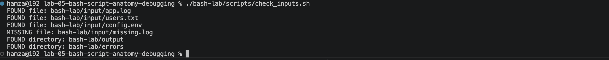
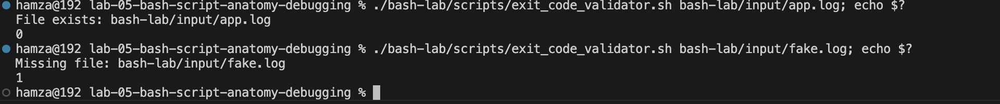
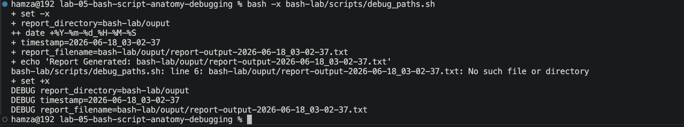

# Lab 05 — Bash Script Anatomy, Conditions & Debugging

**Environment:** macOS Sequoia | Zsh | VS Code Terminal | Apple Silicon (M-series)

---

## Problem

Running commands manually is not the same as building reliable automation.

A script that silently fails, writes output to the wrong place, or continues when required inputs are missing causes more damage than no script at all.

Needed to understand how to:

- structure Bash scripts correctly
- use variables safely and predictably
- check files and directories before using them
- write conditions that handle both success and failure
- pass arguments so scripts are reusable
- return exit codes so automation tools know what happened
- debug scripts without guessing

---

## What I Built

A structured scripting environment simulating real operational work:

- `bash-lab/scripts/` — all scripts built during the lab
- `bash-lab/input/` — source data: app log, users, config
- `bash-lab/output/` — generated reports
- `bash-lab/errors/` — isolated error logs
- `bash-lab/temp/` — intermediate working files

Used this environment to build and debug 13 scripts covering every core Bash concept, then built a final pattern report tool that accepts arguments, handles missing files, and exits with correct codes.

---

## How I Solved It

**Script Anatomy:**

- Every Bash script starts with `#!/bin/bash`
- Without the shebang the system may not know which interpreter to use
- `bash script.sh` works without execute permission because you call the interpreter directly
- `./script.sh` requires execute permission because the system runs it directly
- Fixed with `chmod +x script.sh`

**Variables:**

- No spaces around `=` in variable assignment
- Always quote variables when using them: `"$variable"`
- Unquoted variables break when values contain spaces
- If the variable is inside an already quoted string it does not need separate quotes

**Command Substitution:**

- `$(command)` stores the output of a command inside a variable
- Only useful for commands that produce output
- Not useful for commands that perform actions like `mkdir`
- `created=$(mkdir -p output)` creates the directory but stores nothing

**File and Directory Checks:**

- `-f` checks if a file exists
- `-d` checks if a directory exists
- `!` negates the condition
- Each file needs its own check joined with `&&`

**if / else / fi:**

- Spaces required inside brackets
- Every if must close with fi
- Outer if checks if the job can run
- Inner if checks what the result was

**Numeric Comparisons:**

- `-eq` equal, `-ne` not equal, `-gt` greater than, `-lt` less than, `-ge` greater or equal, `-le` less or equal
- Use `-eq` for numbers not `=`
- `=` is for comparing strings

**Script Arguments:**

- `$1` first argument, `$2` second argument
- `$@` all arguments, `$#` number of arguments
- Arguments make scripts reusable without hardcoding values
- Always check `$#` before using arguments

**Exit Codes:**

- `exit 0` success
- `exit 1` failure
- `exit 2` wrong usage or missing arguments
- echo tells the human what happened
- exit tells the system what happened
- Check with `echo $?` after running a script

**Debugging with echo:**

- Print variable values to the terminal to inspect what Bash has stored
- `echo "DEBUG report_directory=$report_directory"`
- DEBUG does not create files or folders
- DEBUG only helps you see what Bash is working with

**Debugging with bash -x:**

- `bash -x script.sh` shows every line Bash executes with variable values expanded
- `set -x` turns tracing on inside the script
- `set +x` turns tracing off inside the script
- bash -x is faster than adding echo lines manually

**Working Directory vs Script Location:**

- Relative paths depend on where you run the command from
- Not where the script file lives
- Always run scripts from the correct location

**Clear Error Messages:**

- Vague: `echo "file missing"`
- Specific: `echo "Missing file: bash-lab/input/app.log"`
- Specific messages tell the engineer exactly what failed

---

## Proof

### Script anatomy — hello script running with and without execute permission


### File and directory checks — FOUND and MISSING output



### Warning detector — nested if logic working correctly


### Exit codes — 0 for success, 1 for missing file



### bash -x trace — line by line script execution



### Pattern report — ERROR matches found


### Pattern report — no matches found


---

## Scripts Built

| Script | Purpose |
|---|---|
| `hello_script.sh` | Script anatomy, shebang, variables |
| `path_builder.sh` | Variables and quoting with spaces |
| `command_substitution_test.sh` | Useful vs useless command substitution |
| `check_inputs.sh` | File and directory checks |
| `warning_detector.sh` | Nested if logic |
| `number_compare.sh` | Numeric comparisons |
| `argument_checker.sh` | Script arguments $1 $2 $@ $# |
| `exit_code_validator.sh` | Exit codes 0 1 2 |
| `debug_paths.sh` | Debugging with echo and bash -x |
| `input_validator.sh` | Specific error messages |
| `log_report.sh` | Full report generator drill |
| `pattern_report.sh` | Final reusable pattern report tool |

---

## Break/Fix Summary

| Issue | Cause | Fix |
|---|---|---|
| `!#/bin/bash` failed | Wrong shebang order | `#!/bin/bash` |
| `name = "value"` failed | Spaces around = not allowed | `name="value"` |
| Path broke with spaces | Unquoted variable | `"$variable"` |
| `mkdir` substitution stored nothing | mkdir produces no output | Run mkdir directly without substitution |
| Too many arguments on file check | -f does not accept two files | Use `&&` with separate checks |
| `[!` failed | Missing space after [ | `[ !` with space |
| Typo in path: `bash-lab/ouput` | Missing t in output | Found with echo DEBUG and bash -x |
| Zero-count check ran without file | Check was outside if block | Moved inside file-exists block |
| Script exited 0 on failure | Wrong exit code used | Changed to exit 1 for failure |
| Relative path failed from wrong directory | Ran script from inside scripts/ | Navigated back to lab root |
| `set-x` gave command not found | Missing space | Changed to `set -x` |

---

## Key Scripts

```bash
# Check a file exists before using it
if [ -f "bash-lab/input/app.log" ]; then
    echo "File exists"
else
    echo "Missing file: bash-lab/input/app.log"
    exit 1
fi

# Store command output in a variable
timestamp=$(date +"%Y-%m-%d_%H-%M-%S")
count=$(grep -i "ERROR" bash-lab/input/app.log | wc -l)

# Accept arguments and check they were provided
if [ "$#" -lt 2 ]; then
    echo "Error: expected 2 arguments"
    echo "Usage: ./pattern_report.sh FILE PATTERN"
    exit 2
fi

# Debug variable values
echo "DEBUG report_directory=$report_directory"
echo "DEBUG report_filename=$report_filename"

# Trace entire script
bash -x script.sh
```

---

## Improvements After Completion

- Learned that a script that silently fails is worse than one that errors clearly
- Learned that quoting variables is not optional — it prevents real failures
- Learned that command substitution only works for commands that produce output
- Learned that bash -x is the fastest debugging tool available
- Learned that exit codes are how automation tools decide what to do next
- Learned that the working directory and the script location are not the same thing
- Learned that nested if statements follow a clear pattern: outer checks if the job can run, inner checks the result

---

## Key Takeaway

Before this lab, I ran commands.

After this lab, I built scripts that handle success, failure, missing inputs, and wrong arguments — and tell both the human and the system exactly what happened.

The four questions before every script are:

1. What inputs does this script need?
2. What should happen when everything works?
3. What should happen when something is missing or wrong?
4. How does the system know if it succeeded or failed?

That is the difference between a script and a reliable automation tool.

---

## Next Step

[Lab 06 — Process Management & System Monitoring](../lab-06-process-management/)

