# Lab 07 — Advanced Log Analysis & Configuration Management

**Environment:** macOS Sequoia | Zsh | VS Code Terminal | Apple Silicon (M-series)

---

## Problem

> "Something broke around 10:04. Payments are failing. Config was changed. Logs are huge. Root cause in 15 minutes."

SSH access only. No dashboard. No GUI. Every answer had to come from a terminal command, not from opening a file and reading it.

Needed to:

- find the exact moment and cause of the incident using only log commands
- confirm the finding against a second, independent log source (nginx)
- inspect configuration for unsafe values
- change configuration without ever risking an unrecoverable edit
- monitor the system live without losing history
- validate that the underlying data itself (users, transactions) could be trusted
- automate the entire investigation so it never has to be done by hand again

---

## What I Built

A simulated broken production environment:

- `ops-lab/`
  - `logs/` — `app.log`, `nginx.log`
  - `configs/` — `app.conf`, `database.conf`
  - `data/` — `users.txt`, `transactions.txt`
  - `output/` — generated reports, clean configs, dedup files, live error captures
  - `scripts/` — `incident_report.sh`

Used this environment to reconstruct a real incident timeline, cross-reference two independent logs, safely patch broken configuration, and script the whole investigation into a reusable report generator.

---

## How I Solved It

**Scoping the incident (`grep`, `wc`, `head`/`tail`):**

- `wc -l < app.log` counts entries without printing the filename
- `head -1` / `tail -1` bound the log's time range
- `grep "ERROR"` vs `grep -i "ERROR"` gave two different counts — the gap revealed lowercase `error` entries hiding in the log that a case-sensitive search would silently miss
- `awk '$2 < "10:04"'` / `awk '$2 > "10:04"'` split the log around the suspected incident time using string comparison on the timestamp column

**Finding root cause (`grep`, `sort`, `uniq`):**

- `sort | uniq -c | sort -nr | head -1` surfaced the single most common error
- Filtering for "payment" isolated exactly the failure mode affecting the business
- Comparing which errors existed *before* 10:04 versus only *after* pinpointed what the config change actually broke

**Cross-referencing nginx (`awk` field logic):**

- `awk '{print $9}'` treats the log as columns instead of raw text — this is the difference between counting a real status code and accidentally matching `503` inside a byte count or timestamp with `grep`
- `awk '$9 == 503 && $7 == "/api/payments"'` (AND) isolated exactly the failing endpoint
- `awk '$9 == 500 || $9 == 503'` (OR) caught every server-side failure regardless of exact code
- Comparing the first 503 in nginx against the first ERROR in app.log confirmed both logs agreed on the incident's start time

**Config investigation (`sed`, `cut`, `grep -E`):**

- `sed '/^$/d; /^#/d'` stripped noise (comments, blank lines) before reading the config
- `cut -d= -f1` / `-f2` separated keys from values cleanly, since `KEY=VALUE` has no whitespace for awk to split on by default
- `grep -iE "WORKERS|TIMEOUT|CONNECTIONS|POOL"` and a similar pass over `database.conf` surfaced a low worker count and a live `changeme` password sitting in a config that should never contain default credentials

**Safe config fix (`sed -i.bak`):**

- Every edit was previewed first with plain `sed` (prints the result, changes nothing)
- Every real edit used `sed -i.bak`, which edits in place *and* writes the untouched original to a `.bak` file in the same step
- Verified both sides after each change: `grep` the live file for the new value, `grep` the backup for the old value
- Multiple related values (`MAX_POOL_SIZE`, `IDLE_TIMEOUT`) were changed in a single `sed -i.bak` command using two `-e`/`;`-separated expressions, backed up once

**Live monitoring (`tail -f`, `tee -a`):**

- `tail -f app.log | grep -i "error"` watches only new ERROR lines as they arrive
- `tee -a` (not plain `tee`) writes the filtered stream to disk *while still showing it on screen*, and — critically — appends rather than overwrites, so restarting the monitor doesn't erase what was already captured

**Data integrity (`sort`, `uniq`):**

- Total vs unique counts on `users.txt` (`wc -l` vs `sort | uniq | wc -l`) exposed how much duplication existed
- `sort -nr | head -1` on transactions found the highest (and suspicious) amount; `sort | uniq -c | sort -nr` found which amount repeated unnaturally often — a signal the dataset needed cleaning before being trusted

**Filesystem investigation (`find`, `xargs`):**

- `find ops-lab/ -name "*.log"` / `"*.conf"` / `"*.sh"` located files by type without opening anything
- `find ops-lab/ -type f | xargs du -sh | sort -rh` ranked files by actual disk size
- `find ops-lab/ -mtime -1` / `+30` and `find ops-lab/ -perm 777` flagged recently touched files and dangerously open permissions

**Automation (`incident_report.sh`):**

- Validates argument count and file existence before doing any work, exiting with distinct codes (`2` for missing argument, `1` for missing file, `0` on success)
- Reuses the exact case-insensitive error/warning counts, most-common-error lookup, first/last error timestamps, and post-10:04 error count developed manually earlier in the lab
- Writes a timestamped report into `ops-lab/output/` and prints its location, turning a 15-minute manual investigation into a single repeatable command

---

## Proof

### Incident Scope — log size and time range

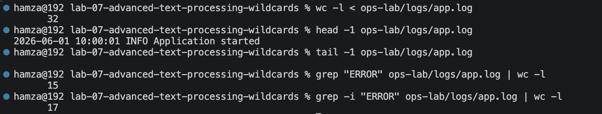


### Root Cause Analysis — most common errors

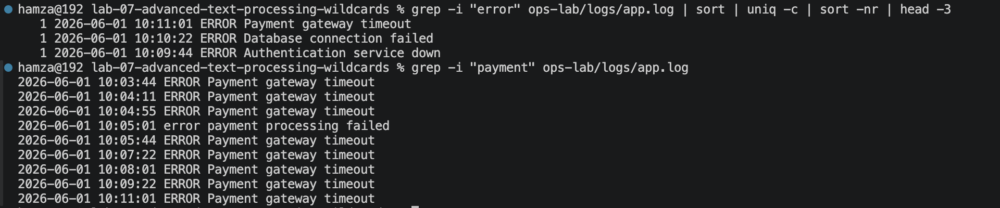

### Incident Timeline — before vs after 10:04

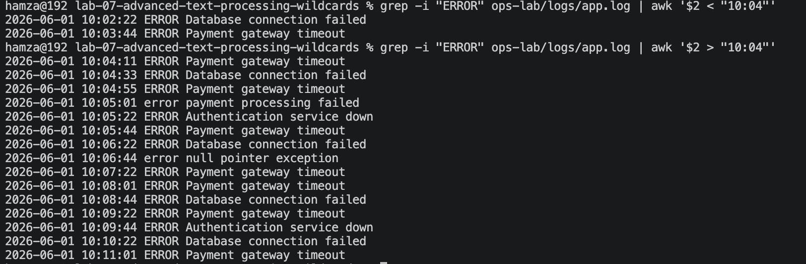

### Nginx Verification

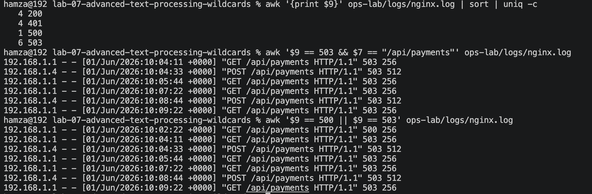

### Configuration Investigation

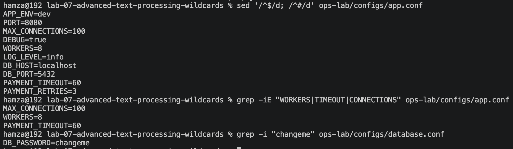

### Safe Configuration Edit

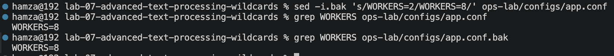

### Live Error Monitoring

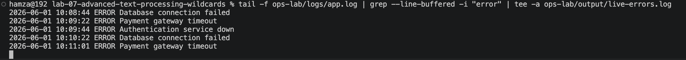

### tee -a Verification

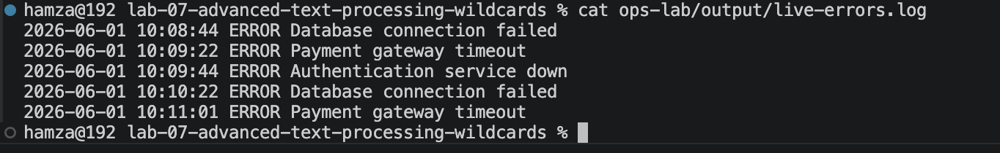

### Data Integrity Investigation

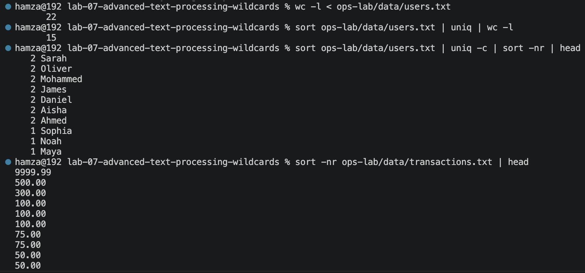
.png)

### Filesystem Investigation

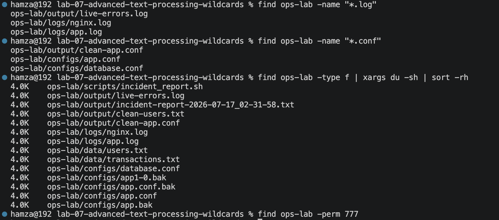

### Automated Incident Report

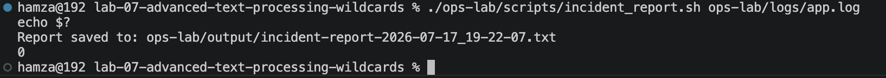

### Error Handling

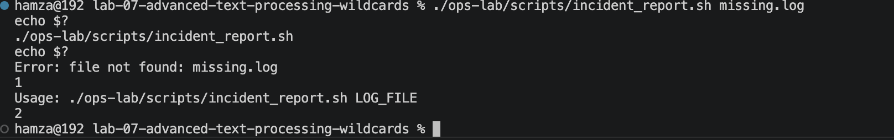

### Break/Fix Verification

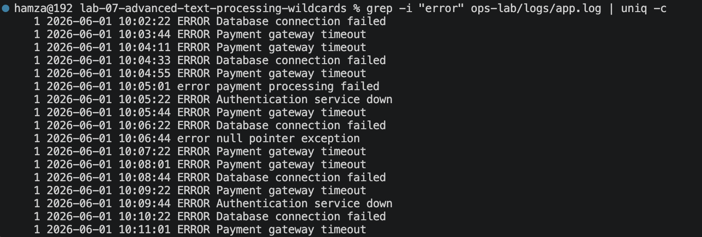
.png)
---

## Break/Fix Summary

| Issue | Cause | Fix |
|---|---|---|
| `grep "error"` undercounted errors | Case-sensitive search missed lowercase `error` lines | Use `grep -i "error"` |
| `uniq -c` gave wrong duplicate counts | Input wasn't sorted before `uniq` | `sort` first, then `uniq -c` |
| `sed -i` destroyed original config value with no way back | `-i` alone has no backup | Always use `sed -i.bak` |
| `awk '{print $2}'` didn't print the IP | Wrong field — nginx log's IP is `$1`, not `$2` | Use `awk '{print $1}'` |
| `find /` flooded the terminal | Permission-denied errors weren't suppressed | Add `2>/dev/null` |
| `grep "ERROR" \| uniq -c \| sort -rn` gave wrong counts | `uniq -c` ran before `sort` | Reorder to `sort \| uniq -c \| sort -nr` |
| `tail app.log \| grep "ERROR"` missed a live error | Plain `tail` only takes a one-time snapshot | Use `tail -f` to watch continuously |

---

## Key Pipelines

```bash
# Case-insensitive vs case-sensitive error count
grep "ERROR" ops-lab/logs/app.log | wc -l
grep -i "ERROR" ops-lab/logs/app.log | wc -l

# Rank errors by frequency — most common first
grep -i "error" ops-lab/logs/app.log | sort | uniq -c | sort -nr | head -3

# Errors before / after the incident time
grep -i "ERROR" ops-lab/logs/app.log | awk '$2 < "10:04"'
grep -i "ERROR" ops-lab/logs/app.log | awk '$2 > "10:04"'

# nginx status code breakdown
awk '{print $9}' ops-lab/logs/nginx.log | sort | uniq -c

# nginx AND / OR field conditions
awk '$9 == 503 && $7 == "/api/payments"' ops-lab/logs/nginx.log
awk '$9 == 500 || $9 == 503' ops-lab/logs/nginx.log

# Clean config view + key/value extraction
sed '/^$/d; /^#/d' ops-lab/configs/app.conf
sed '/^$/d; /^#/d' ops-lab/configs/app.conf | cut -d= -f1
sed '/^$/d; /^#/d' ops-lab/configs/app.conf | cut -d= -f2

# Safe config edit with backup
sed -i.bak 's/WORKERS=2/WORKERS=8/g' ops-lab/configs/app.conf
grep "WORKERS" ops-lab/configs/app.conf
grep "WORKERS" ops-lab/configs/app.conf.bak

# Live monitoring, saved without losing history
tail -f ops-lab/logs/app.log | grep --line-buffered -i "error" | tee -a ops-lab/output/live-errors.log

# Biggest files in the lab
find ops-lab/ -type f | xargs du -sh | sort -rh
```

---

## Improvements After Completion

- Learned that a single count is meaningless without knowing whether the search was case-sensitive and correctly ordered
- Learned that `grep` matches substrings anywhere on a line, while `awk` matches exact fields — this is the difference between a real signal and a false positive
- Learned that a backup is not optional the moment a config edit happens outside of a preview
- Learned that `tail -f` and `tee -a` are the only combination that gives continuous, non-destructive live monitoring
- Learned that cross-referencing two independent logs (app and nginx) is what actually proves a root cause instead of just suggesting one
- Learned that noisy, duplicated, or inconsistent raw data (users, transactions) has to be validated before it can be trusted for reporting
- Learned that a well-built shell script turns a 15-minute manual investigation into a single reusable command with proper exit codes

---

## Key Takeaway

Before this lab, I could run individual commands to answer individual questions.

After this lab, I could reconstruct an entire incident timeline — across two logs, two config files, and raw data — without opening a single file, and turn that whole process into a script that runs itself next time.

The three questions before every investigative command stayed the same as before, but now they had teeth:

1. Is this data sorted/scoped correctly before I trust the count?
2. Is this edit backed up before I apply it?
3. What happens if this pipeline stage runs in the wrong order?

That is the difference between running commands and running an incident response.

---

## Next Step

[Lab 08 — Bash Data Types, Numerics & String Manipulation](../lab-08-bash-data-types-numerics-string-manipulation/)